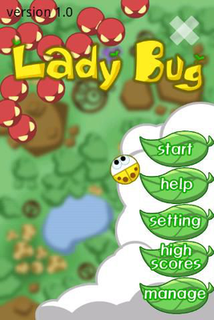
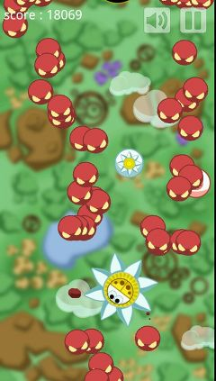

# 　:bookmark:게임제목 : MonsterSurvival

## 게임컨셉
> 기존 게임 "레이디 버그"를 모티브로
픽셀아트 (도트) 느낌의 일방진행 서바이벌 게임

## 게임 플로우 
> 자이로 센서를 이용한 플레이어 조종과
랜덤으로 생성되는 아이템을 통해 몰려오는 적들로부터 살아남기
>>※플레이어는 직접 공격 불가능※

# 　　　 　:white_check_mark:개발범위

## 조작 
  * 로비 버튼조작 
  * 자이로 센서의 기울기로 플레이어 이동 
  
##  배경
  * 심리스 이미지로 자연스러운 스크롤링
## 플레이어 스텟 
  * 몬스터를 처치하고 얻은 코인으로 성장
  * 체력 (기존 3칸 / 최대 5칸)
  * 이동속도 (최대 20퍼센트)
  * 이외 개발중 추가 예정
  
## 아이템 
* 필드에서 랜덤 생성 
* 플레이어 주변을 돌면서 적을 공격하는 아이템
* 랜덤한 방향으로 나아가는 탄을 발사하는 아이템
* 한방향으로 나아가며 적을 공격하는 발판 생성 아이템
* 

## UI
  * 로비
    * 스테이지 선택 버튼
    * 소리 설정 버튼
    * 언어 선택 버튼
    * 스텟 성장 버튼
   
  * 인게임
    * 플레이어 체력
    * 게임 진행 정도를 나타내는 표
    * 일시정지 버튼
    * 점수판
    
## 스테이지
  * 1단계 
  * 2단계
  * 무한모드 
 
# 　:video_game:예상 게임 흐름 및 스크린샷 
 
>(레이디 버그 게임 스크린샷)

# 　　　　　:date:개발일정 

|　기간　|　내용　|
|:---|:---:|
|　1주차　|　 이미지 수집 및 부족 이미지 제작　|
|　2주차　|　 로비 버튼 구성 및 플레이어 스텟 설정　|
|　3주차　|　 인게임 배경 스크롤링 및 플레이어 세팅　|
|　4주차　|　 자이로 센서 공부　|
|　5주차　|　 자이로 센서로 플레이어 이동 구현　|
|　6주차　|　 몬스터(적) 생성 및 충돌 구현　|
|　7주차　| 　아이템 구현　|
|　8주차　| 　기간중 끝내지 못한 요소 마저 구현　|
|　9주차　|　 버그확인 및 수정 후 최종 릴리즈 　|

# 　　　　　:bulb:발표영상
https://youtu.be/wc1pHoYdIjI
